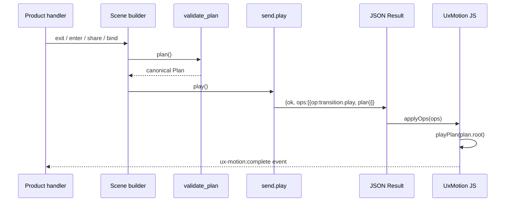

# Architecture

## Layer cake (top → bottom)

```
┌─────────────────────────────────────────────────────────────┐
│  Product code (Python domain handlers)                      │
│  scene()…play()  |  patterns.page()  |  send.play(plan)     │
└─────────────────────────────────────────────────────────────┘
                             │ Plan dict (IR v1)
┌─────────────────────────────────────────────────────────────┐
│  Facade  ux_motion/__init__.py                              │
│  Frozen public names only                                   │
└─────────────────────────────────────────────────────────────┘
         ┌──────────────────┼──────────────────┐
         ▼                   ▼                   ▼
   _api.py Scene       _recipes + _tokens   _patterns
   constructors        Recipe families      page/modal/…
         │                   │                   │
         └─────────┴─────────┘──────────────────┘
                   ▼
            _compile.py → _ir.validate_plan
                   │
                   ▼  canonical Plan
         ┌────────┴──────────┐
         ▼                    ▼
   _ops.play /           _player.interpret
   as_update /           explain / frames
   rewind                (schedule contract)
         │
         ▼
   _adapter.send → Result { ok, ops[], meta? }
         │
         ▼  JSON over channel
┌─────────────────────────────────────────────────────────────┐
│  Client                                                     │
│  UxMotion.applyOps(result.ops)   OR   classic morph/remove  │
└─────────────────────────────────────────────────────────────┘
```

## Module responsibilities (exhaustive)

| Module | Responsibility | Must not |
|---|---|---|
| `__init__.py` | Re-export public API; document intent | Contain logic |
| `_contract.py` | `CONTRACT` dict: laws, enums, op names | Change without release note |
| `_ir.py` | Validate + canonicalize every node kind | Know about HTTP or DOM |
| `_compile.py` | Alias `compile_plan` → `validate_plan` | Transform semantics |
| `_api.py` | Fluent `Scene` + functional `track`/`share`/… | Emit channel ops itself (except via send) |
| `_recipes.py` | Named Recipe factories | Validate full plans |
| `_tokens.py` | Design-system numbers | Hard-code into IR as required fields |
| `_ops.py` | Plan → ops list; invert for rewind; project update | Talk to network |
| `_adapter.py` | `send.play/update/rewind/cancel` → Result | Alternate IR shapes |
| `_player.py` | Deterministic schedule; explain; SVG frames | Touch real DOM |
| `_patterns.py` | Multi-track choreographies | Introduce new IR kinds |
| `_schema.py` | JSON Schema document of IR | Runtime validation (IR does that) |
| `_presence.py` | `stamp` / `region` / server-side Presence set | Animate |
| `_wire.py` | JSON dumps/loads with validation on load | Pretty-print as semantic change |
| `static/ux-motion-player.js` | Execute plans in browser | Invent schedule order different from `_player.py` |

## Dependency graph (allowed imports)

```
__init__
  → everything public

_api → _adapter, _compile, _ir, _ops, _recipes
_adapter → _compile, _ops
_ops → _ir
_player → _ir
_patterns → _api, _recipes, _tokens
_recipes → _tokens
_schema → _contract
_wire → _ir
_compile → _ir

Forbidden cycles: _ir must not import _api, _ops, _player, _adapter.
```

## Data flow: authoring → wire → play



## Data flow: multi-hop score

```mermaid
sequenceDiagram
    participant S as Server
    participant C as Client player

    S->>C: Result A — score(id=checkout, phase=hold) + exit #cart
    Note over C: Exit animates; nodes held in scores Map
    C-->>S: (user continues / next action)
    S->>C: Result B — cue(score=checkout) + enter #pay
    Note over C: Resolve hold; enter plays; score deleted
```

## Data flow: share (FLIP)

```mermaid
sequenceDiagram
    participant S as Server
    participant C as Client

    S->>C: plan with share(id=hero, leave=#grid, arrive=#pdp)
    C->>C: measure getBoundingClientRect(leave)
    C->>C: measure getBoundingClientRect(arrive)
    C->>C: invert delta on arrive; animate to identity
    C->>C: hide/remove leave after finish
```

## Runtime clocks (critical)

There are **two clocks**:

1. **Logical schedule clock** — discrete milliseconds in `interpret()`. Pure function of the Plan (+ optional stagger counts). This is the **contract**.
2. **Physical clock** — WAAPI / rAF / scroll position in the browser. May differ in absolute timing under load; **order of starts/ends for a given plan must match** the logical schedule for non-bind plans.

`bind` plans are scrubbed by input progress (0..1), not wall-clock. The logical schedule still defines the *shape* of the tape (which targets exist and their relative spans).

**Never mix clocks in product code.** Do not assume wall-clock equality with `span_ms(plan)`.

## Presence model

- Presence is **per target** (CSS selector / data-uxm-id), not one global React tree.
- Exit with `after: "remove"` | `"hide"` | `"keep"` decides the end state.
- `share` is identity continuity across two targets.
- `score` holds exit presence across separate HTTP Results until `cue`.

## Interrupt policies (plan.interrupt)

| Value | Behavior |
|---|---|
| `replace` | Cancel in-flight animations on overlapping targets; start new plan |
| `queue` | If anything is playing, enqueue this plan until idle |
| `ignore` | If a plan with the same `id` is already playing, return that promise |

Cancel (`transition.cancel`) clears the queue and all running animations.

## Engine field (plan.engine)

| Value | Client behavior |
|---|---|
| `presence` | Default WAAPI / recipe animation |
| `view` | Wrap in `document.startViewTransition` when available and motion not reduced |
| `spring` | Prefer spring duration estimation when recipes carry `spring` params |

Engines are hints. Missing browser features fall back to presence. Schedule order does not change.
