# Diagrams — every concept at a glance

All diagrams are **Mermaid**. They render in GitHub, many IDEs, and [mermaid.live](https://mermaid.live).  
Nothing here is decorative: each diagram is a contract view of the system.

---

## 1. System at a glance

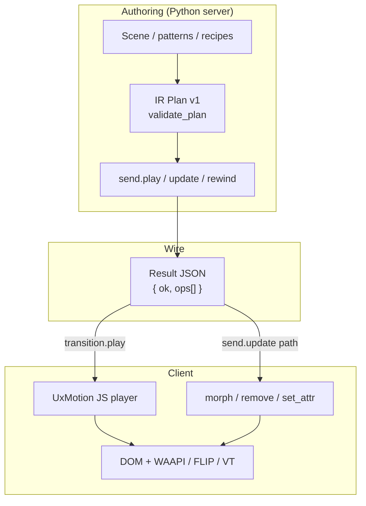
```mermaid
flowchart TB
  subgraph Authoring["Authoring (Python server)"]
    Scene["Scene / patterns / recipes"]
    IR["IR Plan v1<br/>validate_plan"]
    Send["send.play / update / rewind"]
  end

  subgraph Wire["Wire"]
    Result["Result JSON<br/>{ ok, ops[] }"]
  end

  subgraph Client["Client"]
    Player["UxMotion JS player"]
    DOM["DOM + WAAPI / FLIP / VT"]
    Classic["morph / remove / set_attr"]
  end

  Scene --> IR --> Send --> Result
  Result -->|transition.play| Player --> DOM
  Result -->|send.update path| Classic --> DOM
```

---

## 2. Module dependency graph

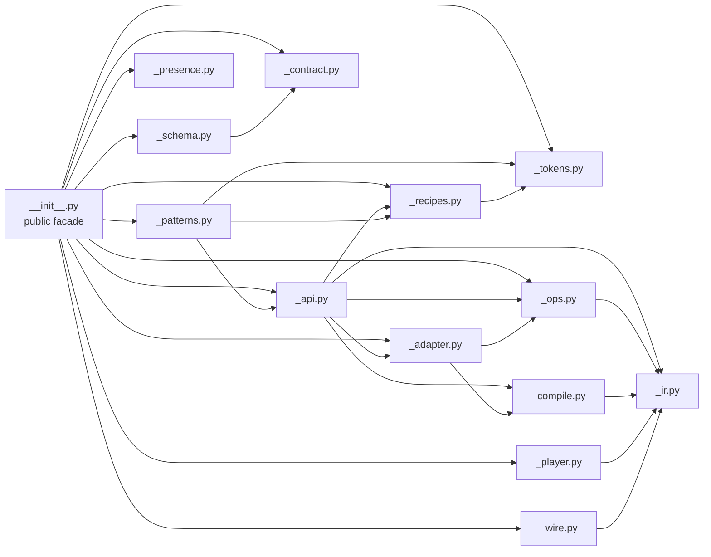
```mermaid
flowchart LR
  init["__init__.py<br/>public facade"]
  api["_api.py"]
  recipes["_recipes.py"]
  tokens["_tokens.py"]
  patterns["_patterns.py"]
  ir["_ir.py"]
  compile["_compile.py"]
  ops["_ops.py"]
  adapter["_adapter.py"]
  player["_player.py"]
  wire["_wire.py"]
  contract["_contract.py"]
  schema["_schema.py"]
  presence["_presence.py"]

  init --> api & recipes & tokens & patterns & ops & adapter & player & wire & contract & schema & presence
  api --> adapter & compile & ir & ops & recipes
  patterns --> api & recipes & tokens
  recipes --> tokens
  adapter --> compile & ops
  ops --> ir
  compile --> ir
  player --> ir
  wire --> ir
  schema --> contract
```

**Rule:** `_ir` never imports `_api`, `_ops`, `_player`, or `_adapter`.

---

## 3. Plan object tree

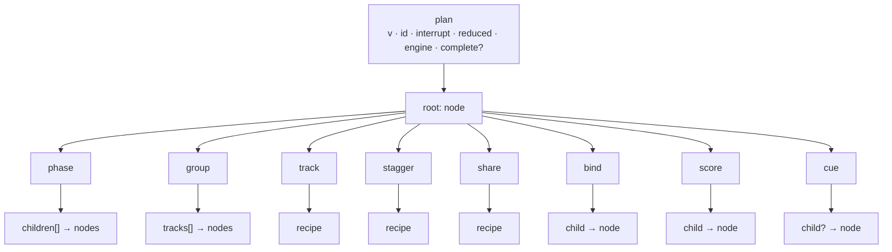
```mermaid
flowchart TB
  Plan["plan<br/>v · id · interrupt · reduced · engine · complete?"]
  Root["root: node"]
  Plan --> Root

  Root --> Phase["phase"]
  Root --> Group["group"]
  Root --> Track["track"]
  Root --> Stagger["stagger"]
  Root --> Share["share"]
  Root --> Bind["bind"]
  Root --> Score["score"]
  Root --> Cue["cue"]

  Phase --> Children["children[] → nodes"]
  Group --> Tracks["tracks[] → nodes"]
  Bind --> ChildB["child → node"]
  Score --> ChildS["child → node"]
  Cue --> ChildC["child? → node"]
  Track --> RecipeT["recipe"]
  Stagger --> RecipeSt["recipe"]
  Share --> RecipeSh["recipe"]
```

---

## 4. Composition modes

### parallel

```mermaid
gantt
  title parallel — all start at t0
  dateFormat X
  axisFormat %s
  section A
  exit #old           :0, 100
  section B
  enter #new          :0, 100
```

### sequence

```mermaid
gantt
  title sequence — B starts when A ends
  dateFormat X
  axisFormat %s
  section A
  exit #old           :0, 100
  section B
  enter #new          :100, 100
```

### wait (direct tracks)

```mermaid
gantt
  title wait — exits finish before enters
  dateFormat X
  axisFormat %s
  section exits
  exit #old           :0, 200
  section enters
  enter #new          :200, 280
```

### wait with nested group (independent clocks)

```mermaid
gantt
  title wait + nested sequence — nested starts at t0
  dateFormat X
  axisFormat %s
  section nested_rail
  exit #rail-a        :0, 160
  enter #rail-b       :160, 200
  section direct_main
  exit #story         :0, 200
  enter #story        :200, 280
```

---

## 5. wait partition algorithm

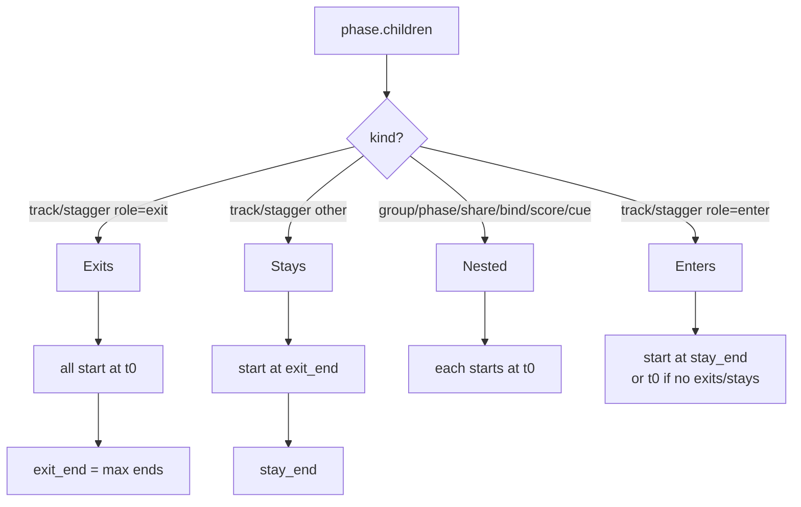
```mermaid
flowchart TD
  Kids["phase.children"]
  Kids --> Split{kind?}
  Split -->|track/stagger role=exit| Exits
  Split -->|track/stagger role=enter| Enters
  Split -->|track/stagger other| Stays
  Split -->|group/phase/share/bind/score/cue| Nested

  Exits --> E1["all start at t0"]
  E1 --> ExitEnd["exit_end = max ends"]
  Stays --> S1["start at exit_end"]
  S1 --> StayEnd["stay_end"]
  Nested --> N1["each starts at t0"]
  Enters --> EN1["start at stay_end<br/>or t0 if no exits/stays"]
```

---

## 6. Presence lifecycle (one track)

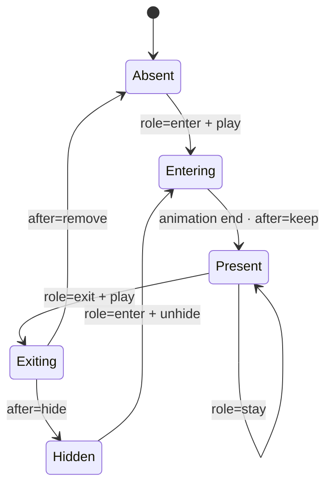
```mermaid
stateDiagram-v2
  [*] --> Absent
  Absent --> Entering: role=enter + play
  Entering --> Present: animation end · after=keep
  Present --> Exiting: role=exit + play
  Exiting --> Absent: after=remove
  Exiting --> Hidden: after=hide
  Hidden --> Entering: role=enter + unhide
  Present --> Present: role=stay
```

---

## 7. Role × after matrix

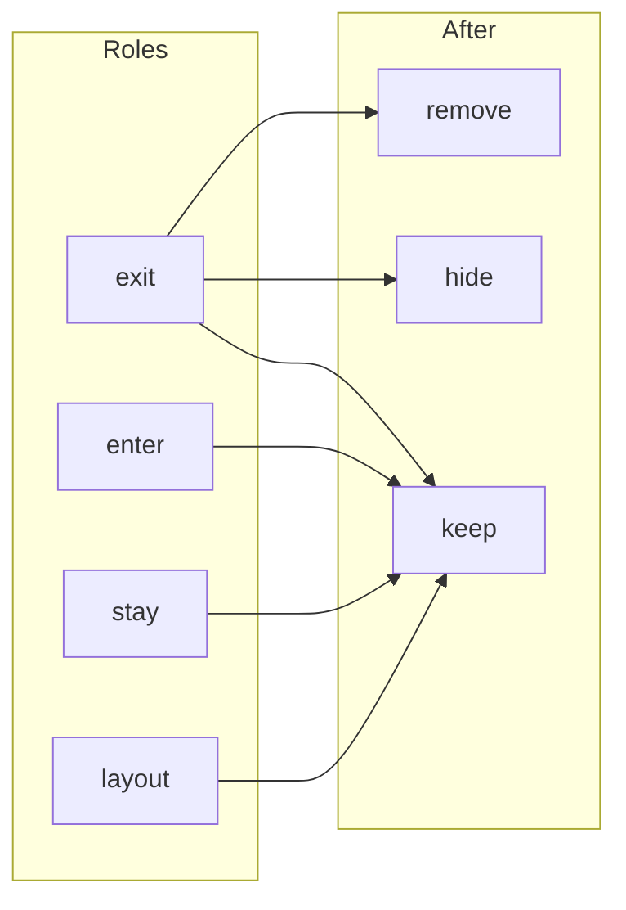
```mermaid
flowchart LR
  subgraph Roles
    exit
    enter
    stay
    layout
  end
  subgraph After
    keep
    remove
    hide
  end
  exit --> remove
  exit --> hide
  exit --> keep
  enter --> keep
  stay --> keep
  layout --> keep
```

`layout` schedules like `stay`. Use **share** for FLIP, not layout.

---

## 8. Authoring → wire → play sequence

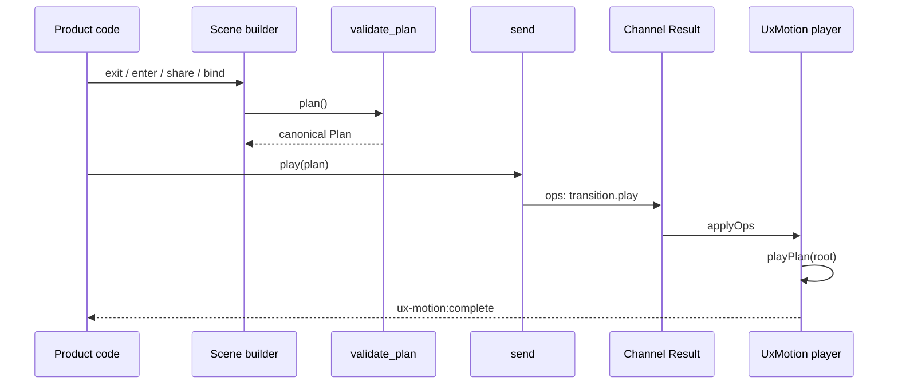
```mermaid
sequenceDiagram
  participant App as Product code
  participant Scene as Scene builder
  participant Val as validate_plan
  participant Send as send
  participant Ch as Channel Result
  participant P as UxMotion player

  App->>Scene: exit / enter / share / bind
  Scene->>Val: plan()
  Val-->>Scene: canonical Plan
  App->>Send: play(plan)
  Send->>Ch: ops: transition.play
  Ch->>P: applyOps
  P->>P: playPlan(root)
  P-->>App: ux-motion:complete
```

---

## 9. send.play vs send.update vs send.rewind

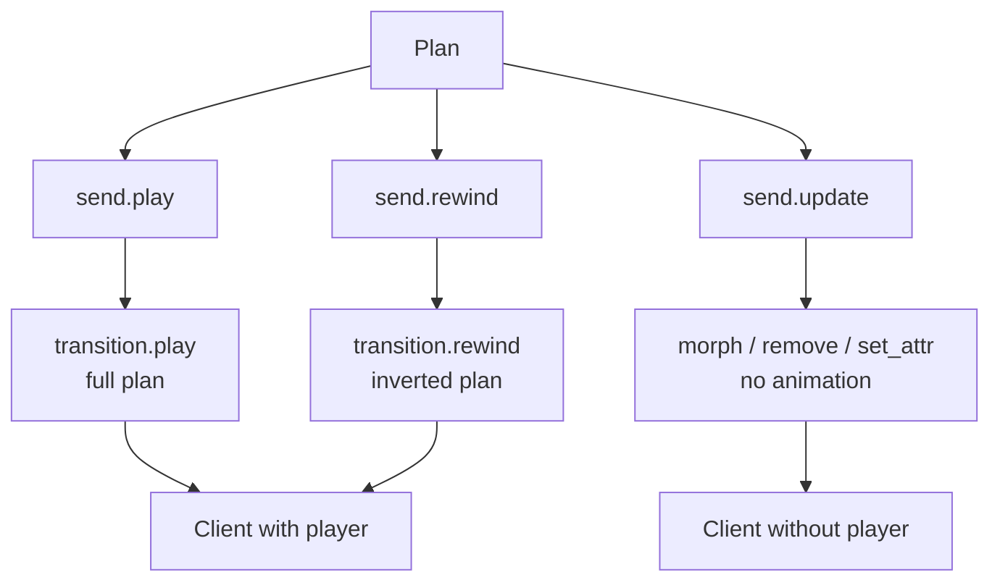
```mermaid
flowchart TB
  Plan["Plan"]
  Plan --> Play["send.play"]
  Plan --> Update["send.update"]
  Plan --> Rewind["send.rewind"]

  Play --> OP1["transition.play<br/>full plan"]
  Update --> OP2["morph / remove / set_attr<br/>no animation"]
  Rewind --> OP3["transition.rewind<br/>inverted plan"]

  OP1 --> Capable["Client with player"]
  OP2 --> Legacy["Client without player"]
  OP3 --> Capable
```

---

## 10. Share (FLIP) flow

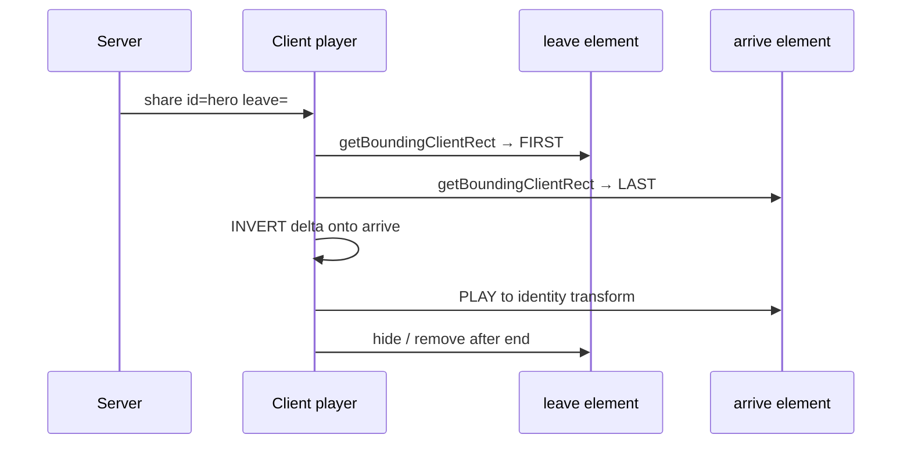
```mermaid
sequenceDiagram
  participant S as Server
  participant C as Client player
  participant L as leave element
  participant A as arrive element

  S->>C: share id=hero leave=#grid arrive=#pdp
  C->>L: getBoundingClientRect → FIRST
  C->>A: getBoundingClientRect → LAST
  C->>C: INVERT delta onto arrive
  C->>A: PLAY to identity transform
  C->>L: hide / remove after end
```

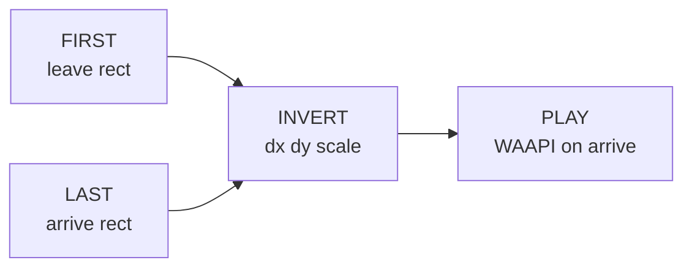
```mermaid
flowchart LR
  F["FIRST<br/>leave rect"] --> I["INVERT<br/>dx dy scale"]
  L["LAST<br/>arrive rect"] --> I
  I --> P["PLAY<br/>WAAPI on arrive"]
```

---

## 11. Bind (scrub tape)

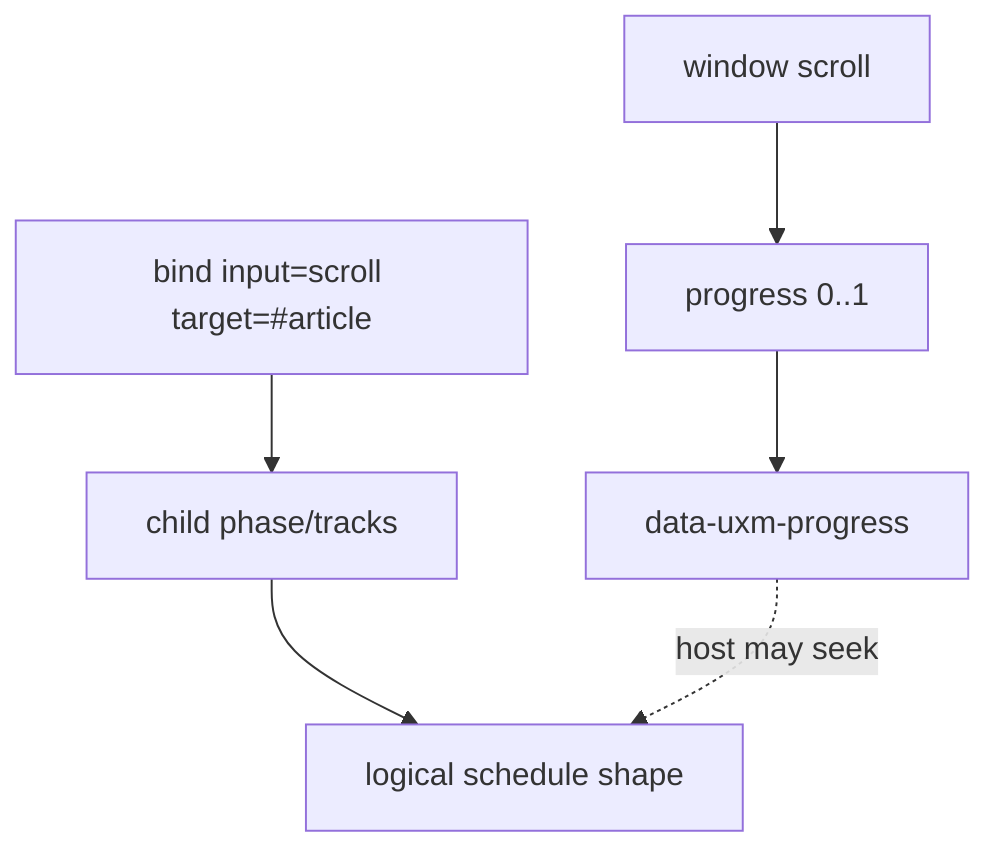
```mermaid
flowchart TB
  Bind["bind input=scroll target=#article"]
  Child["child phase/tracks"]
  Bind --> Child
  Scroll["window scroll"] --> Progress["progress 0..1"]
  Progress --> Attr["data-uxm-progress"]
  Child --> Tape["logical schedule shape"]
  Attr -.->|"host may seek"| Tape
```

---

## 12. Score + cue multi-hop

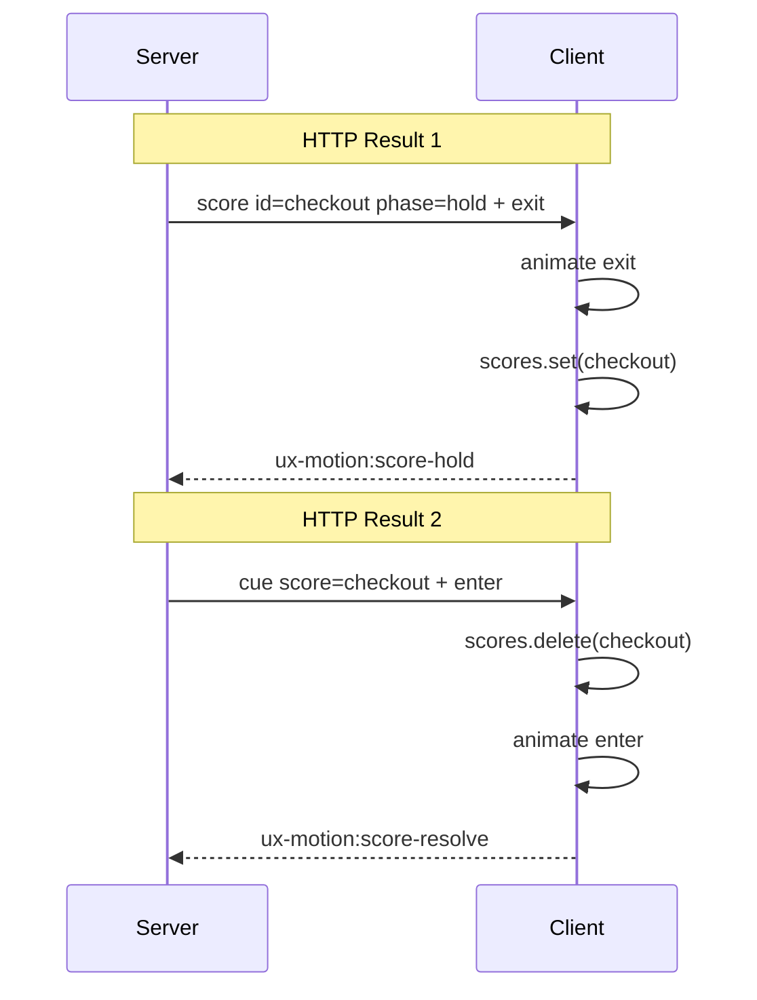
```mermaid
sequenceDiagram
  participant S as Server
  participant C as Client

  Note over S,C: HTTP Result 1
  S->>C: score id=checkout phase=hold + exit #cart
  C->>C: animate exit
  C->>C: scores.set(checkout)
  C-->>S: ux-motion:score-hold

  Note over S,C: HTTP Result 2
  S->>C: cue score=checkout + enter #pay
  C->>C: scores.delete(checkout)
  C->>C: animate enter
  C-->>S: ux-motion:score-resolve
```

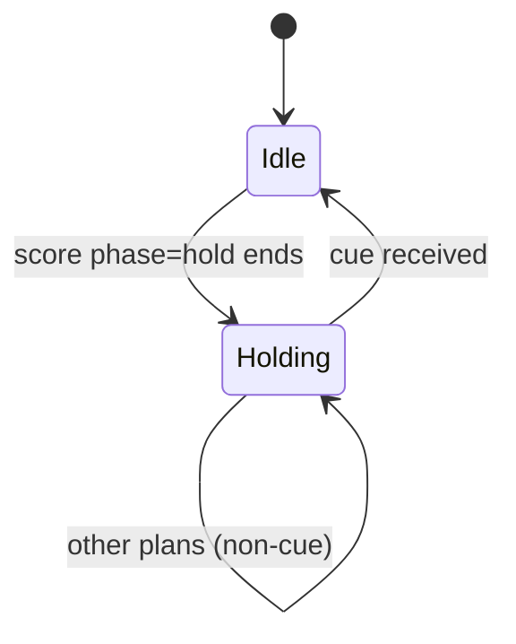
```mermaid
stateDiagram-v2
  [*] --> Idle
  Idle --> Holding: score phase=hold ends
  Holding --> Idle: cue received
  Holding --> Holding: other plans (non-cue)
```

---

## 13. Recipe → visual properties

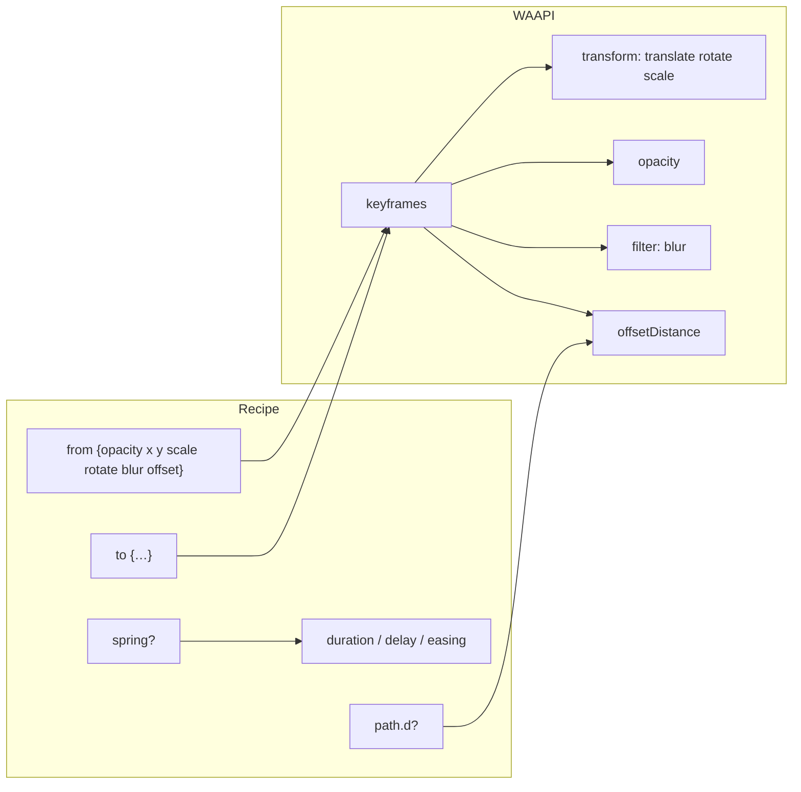
```mermaid
flowchart LR
  subgraph Recipe
    from["from {opacity x y scale rotate blur offset}"]
    to["to {…}"]
    dur["duration / delay / easing"]
    spring["spring?"]
    path["path.d?"]
  end

  subgraph WAAPI
    KF["keyframes"]
    TR["transform: translate rotate scale"]
    OP["opacity"]
    FL["filter: blur"]
    OD["offsetDistance"]
  end

  from --> KF
  to --> KF
  KF --> TR & OP & FL & OD
  path --> OD
  spring --> dur
```

---

## 14. Interrupt policies

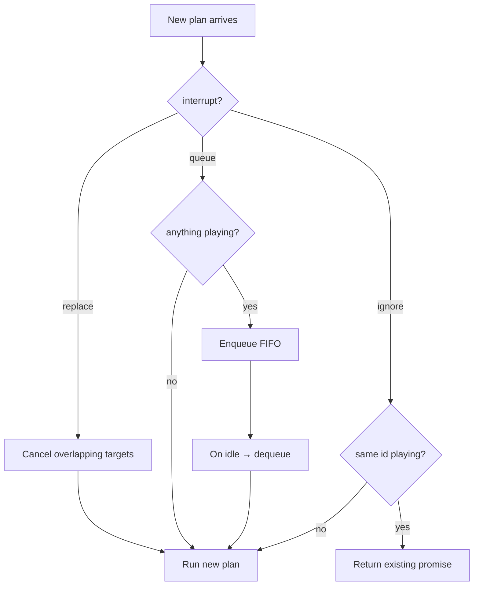
```mermaid
flowchart TD
  New["New plan arrives"]
  New --> R{interrupt?}
  R -->|replace| Cancel["Cancel overlapping targets"] --> Run["Run new plan"]
  R -->|queue| Busy{anything playing?}
  Busy -->|yes| Q["Enqueue FIFO"]
  Busy -->|no| Run
  Q --> Idle["On idle → dequeue"] --> Run
  R -->|ignore| Same{same id playing?}
  Same -->|yes| Reuse["Return existing promise"]
  Same -->|no| Run
```

---

## 15. Reduced motion paths

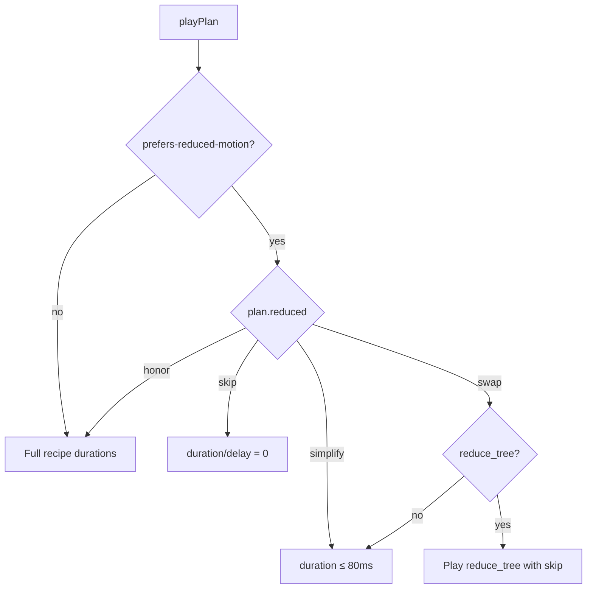
```mermaid
flowchart TD
  Play["playPlan"]
  Play --> Pref{prefers-reduced-motion?}
  Pref -->|no| Full["Full recipe durations"]
  Pref -->|yes| Mode{plan.reduced}
  Mode -->|skip| Zero["duration/delay = 0"]
  Mode -->|simplify| Cap["duration ≤ 80ms"]
  Mode -->|honor| Full
  Mode -->|swap| Tree{reduce_tree?}
  Tree -->|yes| Alt["Play reduce_tree with skip"]
  Tree -->|no| Cap
```

---

## 16. Engine selection

```mermaid
flowchart TD
  E{plan.engine}
  E -->|presence| WAAPI["WAAPI recipes"]
  E -->|view| VT{startViewTransition?}
  VT -->|yes + not reduced| Wrap["Wrap run in View Transition"]
  VT -->|no| WAAPI
  E -->|spring| SP["Spring duration estimate<br/>+ WAAPI"]
```

---

## 17. as_update projection

```mermaid
flowchart TB
  Plan --> Walk["Walk all tracks/share/stagger"]
  Walk --> T{node}
  T -->|enter + html| Morph["morph"]
  T -->|enter| Present["set_attr present=1"]
  T -->|exit remove| Remove["remove"]
  T -->|exit hide| Hide["set_attr hidden"]
  T -->|stagger enter| SA["set_attr on selector"]
  T -->|stagger exit remove| RM["remove on selector"]
  T -->|share| SH["arrive present+id · leave present=0"]
  T -->|nothing| Noop["noop"]
```

---

## 18. Rewind inversion

```mermaid
flowchart LR
  Enter["enter track"] --> Exit["exit track"]
  Exit2["exit track"] --> Enter2["enter track"]
  FromTo["from / to"] --> Swap["swapped"]
  Children["group/phase children"] --> Rev["reversed + each inverted"]
  ShareL["share leave/arrive"] --> ShareS["swapped"]
```

---

## 19. Tokens map

```mermaid
flowchart TB
  tokens["tokens"]
  tokens --> D["duration<br/>instant fast enter exit page modal stagger spring"]
  tokens --> E["easing<br/>linear enter exit soft snap"]
  tokens --> Dist["distance<br/>xs sm md lg xl"]
  tokens --> SP["spring<br/>snappy gentle wobbly stiff"]
```

---

## 20. Pattern catalog

```mermaid
flowchart TB
  patterns["patterns"]
  patterns --> page["page<br/>exit → enter"]
  patterns --> modal["modal<br/>overlay + panel"]
  patterns --> toast["toast<br/>edge slide"]
  patterns --> list["list_stagger"]
  patterns --> shared["shared_page<br/>share + fades"]
  patterns --> hopL["multi_hop_leave"]
  patterns --> hopA["multi_hop_arrive"]
  hopL -.->|score id| hopA
```

---

## 21. End-to-end mental model (one picture)

```mermaid
flowchart TB
  subgraph Server
    Domain["Domain action"]
    Build["Build Scene / pattern"]
    Seal["compile = validate IR"]
    Emit["send.play | update | rewind"]
  end

  subgraph Network
    JSON["JSON Result"]
  end

  subgraph Browser
    Apply["UxMotion.applyOps"]
    Sched["Match interpret order"]
    Phys["WAAPI / FLIP / VT / spring / path"]
    DOM["DOM presence"]
  end

  Domain --> Build --> Seal --> Emit --> JSON --> Apply --> Sched --> Phys --> DOM
```

---

## How to view

1. Open any `.md` file in an editor with Mermaid preview, or
2. Paste a fenced block into https://mermaid.live, or
3. Push to GitHub — diagrams render automatically in the file view.
