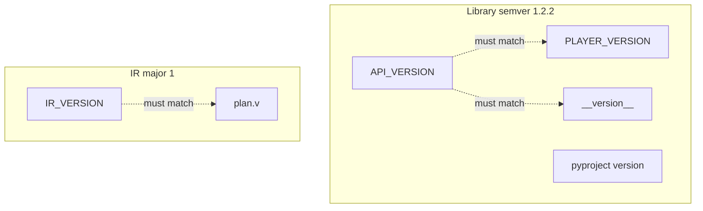

# Versioning policy

ux_motion is at **1.2.2**. Three version numbers exist on purpose. Do not collapse them.

---

## The three versions

| Name | Where | Current | What it means |
|---|---|---|---|
| **Library / API** | `__version__`, `API_VERSION`, `CONTRACT["api"]`, `pyproject.toml`, JS `UxMotion.version`, `PLAYER_VERSION` | **1.2.2** | Python facade + aligned browser player |
| **Plan IR** | `IR_VERSION`, plan field `v`, `CONTRACT["ir"]` | **1** | JSON wire shape for plans |
| **Package release** | Git tag / zip name / PyPI | **1.2.2** | Same as library for this project |



---

## Single source of truth

File: **`ux_motion/_version.py`**

```python
__version__ = "1.2.2"
API_VERSION = __version__
IR_VERSION = "1"
PLAYER_VERSION = __version__
```

- Bump library numbers **only** in `_version.py`, then mirror into:
  - `pyproject.toml` → `project.version`
  - `CONTRACT["api"]` and `CONTRACT["player"]` in `_contract.py`
  - `static/ux-motion-player.js` → `UxMotion.version`
  - `CHANGELOG.md`
- Bump `IR_VERSION` only when the wire plan **breaks** receivers.

A release checklist test (`test_versions`) fails if API / player / contract drift.

---

## When to bump what

### Library API (`1.0.0` → `1.0.0` / `2.0.0`)

| Change | Bump |
|---|---|
| New public function or pattern (additive) | **MINOR** |
| New optional IR field (old players ignore) | **MINOR** (library) — IR stays `1` |
| Bugfix, docs, tests only | **PATCH** |
| Rename/remove public facade name | **MAJOR** |
| Change meaning of existing public behavior | **MAJOR** |

### Plan IR (`v: "1"` → `v: "2"`)

| Change | Bump IR major? |
|---|---|
| New optional field / new kind old players no-op | **No** — stay on `1` |
| Remove field, change type, reuse key | **Yes** — `v: "2"` |
| Require a field that old docs omitted | **Yes** |

**Law:** keys are never reused with new meanings inside the same IR major.

---

## Compatibility promises (1.x)

1. Code written against `ux_motion` 1.0 public names keeps working on 1.x minors.
2. A plan with `"v": "1"` that validated on 1.0.0 still validates on later 1.x (unknown fields may be stripped).
3. `send.play` / `send.update` / `send.rewind` keep their Result shapes; new ops may appear only under new names.
4. JS player `UxMotion.version` matches `API_VERSION` for official releases.

---

## Tag and artifact naming

```
Git tag:     v1.2.2
Zip:         ux_motion-1.2.2-complete.zip
PyPI name:   ux-motion  (import name remains ux_motion)
```

---

## How to release (maintainers)

1. Update `_version.py`
2. Update `pyproject.toml` version
3. Update `CONTRACT["api"]` and `CONTRACT["player"]`
4. Update `static/ux-motion-player.js` version string
5. Write `CHANGELOG.md` section
6. Run `python -m unittest discover -s tests -v`
7. Tag `vX.Y.Z` and build the zip
