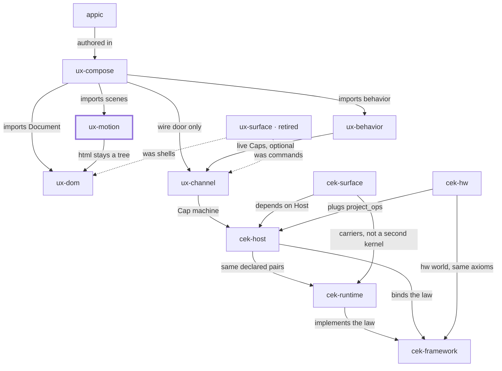

# Place in the stack

**You are here:** `ux-motion` in [bitplorer/ux-motion](https://github.com/bitplorer/ux-motion).

Presence and transition as data. A scene plan, not a behavior and not a DOM builder. A ux-dom tree passed as html stays a tree until dumps or play.

The picture is the same in every repo. The thick stroke is this library. A missing line is a missing door, not a forgotten one. Dashed lines are history.

## Owns

Presence and transition plans (IR v1) and the vanilla player.

## Refuses

Product behavior and DOM construction.

## Install

pip install ux-motion. Import ux_motion. No CLI. Python 3.14 or newer.

## Doors

### Uses

- [ux-dom](https://github.com/bitplorer/ux-dom) — html stays a tree

### Used by

- [ux-compose](https://github.com/bitplorer/ux-compose) — imports scenes

## The stack

## The walk

Mint, intent, verify, project, apply, undo.

1. **Mint.** Host mints a Cap. The subject on the Cap is the subject in the args. dev is the workshop. prod refuses the workshop secret.
2. **Intent.** Channel carries action, args, and cap. That is the click. It is not a form post.
3. **Verify.** Host verifies the Cap before any shared-world write. A bad Cap, or a store that is down, refuses. ops is empty. The peer never mints.
4. **Project.** Only declared pairs leave the host. Baseline and ui.dom are the catalog. Hardware pairs arrive through project_ops. They are not a fork of Host.
5. **Apply.** The peer applies the ops. DOM is one world. GPIO is another. Surface carries the IR. It does not decide.
6. **Undo.** Lineage records the cause. End or revoke reverses it, or the op is marked non-reversible. A trace id never grants permission.

ux-motion runs after the world has changed. It does not authorize the change.

## Notes

- Pure Python facade. No React.
- Morph, then play.
