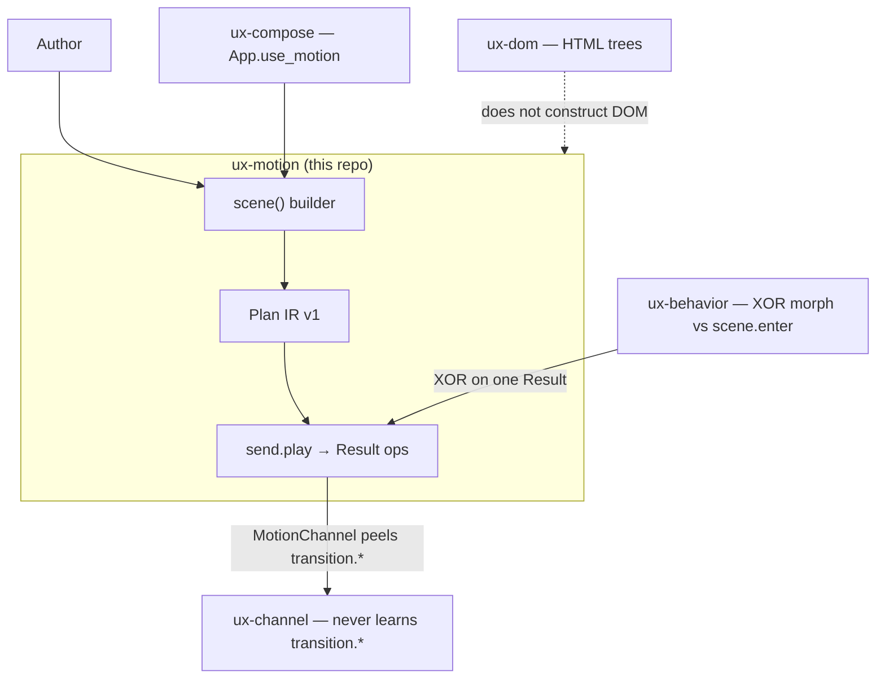

# C4-style overview — ux-motion

> **Diátaxis:** explanation · **Canonical:** `docs/internals/c4.md` · **Layer:** ux-motion
> Map: [../INDEX.md](../INDEX.md).

Grounded in [../01-ARCHITECTURE.md](../01-ARCHITECTURE.md) and
[../14-CHANNEL-COMPOSITOR.md](../14-CHANNEL-COMPOSITOR.md).
This layer owns presence / transition plans as data (IR v1).
It does **not** own product behavior or DOM construction.

## Context

Module cake: [../01-ARCHITECTURE.md](../01-ARCHITECTURE.md).
Diagrams: [../12-DIAGRAMS.md](../12-DIAGRAMS.md).
